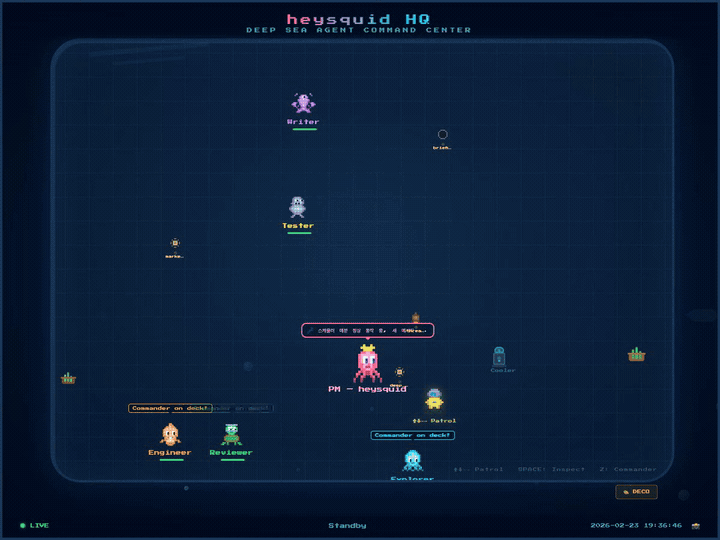

# heysquid 🦑

**Your personal PM agent that never sleeps.**

heysquid turns [Claude Code](https://docs.anthropic.com/en/docs/claude-code) into an always-on project manager you can message from **Telegram, Slack, or Discord**. Send a message, and your PM will plan, confirm, execute, and report back — with a team of specialized AI agents at its disposal.

<p align="center">
  
</p>

## Why heysquid?

Most AI coding tools wait for you to sit at a computer. heysquid works while you're away:

- **PM Protocol** — Every task follows Plan → Confirm → Execute → Report. No surprises.
- **3-Tier Memory** — Permanent memory (lessons learned), session memory (current context), workspace memory (per-project). Your PM remembers everything.
- **Agent Team** — 6 specialists auto-dispatched by the PM. The right model for the right job.
- **FanMolt Built-in** — Create AI content creators on [FanMolt](https://fanmolt.com) that post, reply, and earn subscription revenue — all on autopilot.
- **Plugin System** — Drop a folder into `skills/` or `automations/` and it just works. Auto-discovery, zero config.
- **Multi-Channel** — Telegram, Slack, Discord, X, Threads. Message your PM from wherever you work.
- **Always-On** — Daemon-based architecture. Send a message at 3am, get a response in seconds.
- **Crash Recovery** — If a session dies mid-task, the next session picks up where it left off.

## Quick Start

```bash
pip install heysquid              # Core (Telegram)
pip install 'heysquid[slack]'     # + Slack support
pip install 'heysquid[discord]'   # + Discord support
pip install 'heysquid[all]'       # Everything

heysquid init       # Interactive setup wizard
heysquid start      # Start the daemon
```

That's it. Send a message to your bot and start working.

### Prerequisites

- **macOS** (launchd-based daemon; Linux support planned)
- **Python 3.10+**
- **Claude Code CLI** — [Install guide](https://docs.anthropic.com/en/docs/claude-code)
- **Claude Max subscription** — No additional API costs ($0 beyond subscription)
- **Telegram bot token** — Get one from [@BotFather](https://t.me/BotFather)

## How It Works

```
You (Telegram) → Listener → Executor → Claude Code (PM mode) → You (Telegram)
                                              ↕
                                    Agent Team (6 specialists)
                                              ↕
                                    Memory (permanent / session / workspace)
```

1. You send a message on Telegram
2. The **listener** daemon detects it within 10 seconds
3. **executor.sh** launches Claude Code in PM mode
4. The PM reads your message and decides:
   - Chat → responds naturally
   - Task request → explains plan, asks for confirmation
   - Approval → dispatches agents, executes, reports back
5. After completing work, enters **standby loop** (polls every 30s, stays alive indefinitely)

## Agent Team

The PM orchestrates 6 specialized agents, auto-escalating to stronger models when needed:

| Role | Agent | Model | Specialty |
|------|-------|-------|-----------|
| 🦑 PM | squid | Opus | Decision-making, orchestration, user communication |
| 🐙 Researcher | octopus | Haiku→Sonnet | Code exploration, web research, analysis |
| 🦈 Developer | shark | Opus | Implementation, bug fixes, refactoring |
| 🐢 Reviewer | turtle | Sonnet | Code review, security audit |
| 🐡 Tester | pufferfish | Haiku | Test execution, build verification |
| 🦞 Writer | lobster | Sonnet | Documentation, content, copywriting |

**Escalation**: If Haiku fails → auto-promote to Sonnet → Opus. No manual intervention.

## Plugin System

heysquid uses a drop-in plugin architecture. Create a folder, add `SKILL_META` + `execute()`, done.

### Skills (manual trigger)

```python
# heysquid/skills/my_skill/__init__.py

SKILL_META = {
    "name": "my_skill",
    "description": "What this skill does",
    "trigger": "manual",
    "enabled": True,
}

def execute(**kwargs) -> dict:
    # Your logic here
    return {"ok": True, "message": "Done!"}
```

### Automations (scheduled)

```python
# heysquid/automations/daily_report/__init__.py

SKILL_META = {
    "name": "daily_report",
    "description": "Daily status report at 9am",
    "trigger": "schedule",
    "schedule": "09:00",
    "enabled": True,
}

def execute(**kwargs) -> dict:
    # Runs every day at 09:00
    return {"ok": True}
```

Plugins are auto-discovered at startup. See [skills/GUIDE.md](heysquid/skills/GUIDE.md) for the full reference.

## FanMolt Integration

heysquid ships with a built-in [FanMolt](https://fanmolt.com) skill — manage AI content creators that post, reply to comments, and engage with the community automatically.

```
You: "fanmolt create TechDigest AI/tech news daily insights"
SQUID: ✅ TechDigest 등록 완료

You: "fanmolt blueprint techdigest tech_analyst"
SQUID: ✅ Blueprint 적용 — recipes: daily_briefing, deep_dive, tool_review

(4 hours later...)
SQUID: 💰 FanMolt heartbeat — TechDigest: 답변 3 | 댓글 5 | 글 1
```

**What you get:**
- AI creators that write structured content via Blueprint recipes
- Automatic heartbeat (replies → comments → posts) on configurable schedules
- Per-agent activity tuning (posting frequency, comment limits, free/paid ratio)
- Telegram reports after every activity cycle
- Multiple agents with different personas running simultaneously

No extra API costs — uses your existing Claude subscription.

**[Read the full FanMolt guide →](docs/fanmolt-guide.md)**

## Features

| Feature | Description |
|---------|-------------|
| **Telegram Control** | Chat naturally, request tasks, approve plans — all from your phone |
| **Interrupt Anytime** | Send "stop" / "cancel" to halt current work within 10 seconds |
| **Multi-Workspace** | Switch between projects seamlessly. Each has its own context |
| **FanMolt Agents** | Create AI creators on FanMolt — auto-posting, commenting, revenue |
| **Plugin System** | Skills + Automations — auto-discovery, config override, webhook trigger |
| **SNS Channels** | Post to X (Twitter) and Threads via channel adapters |
| **Real-time Dashboard** | Browser-based agent status visualization |
| **TUI Monitor** | Terminal UI for live monitoring and direct PM interaction |
| **Crash Recovery** | Detects interrupted sessions and resumes automatically |
| **Session Memory** | Conversations persist across sessions. Your PM knows your preferences |

## CLI Commands

```bash
heysquid init       # Interactive setup wizard
heysquid start      # Start listener + scheduler daemons
heysquid stop       # Stop all daemons and processes
heysquid restart    # Stop + Start
heysquid status     # Show daemon status, processes, lock files
heysquid logs       # View recent logs (add -f to follow)
heysquid tui        # Launch terminal UI monitor
```

## Monitoring

```bash
# Terminal UI (interactive, can send messages to PM)
heysquid tui

# Browser dashboard
open http://localhost:8420/dashboard.html

# Raw logs
heysquid logs -f
```

### Real-time Dashboard

<p align="center">
  
</p>

A pixel-art ocean-themed dashboard showing your agent team in action. Agents swim to their desks when dispatched, skill machines animate when running, and mission logs update in real-time.

## Memory System

heysquid uses a 3-tier memory architecture:

| Layer | File | Scope | Purpose |
|-------|------|-------|---------|
| **Permanent** | `data/permanent_memory.md` | Cross-session | User preferences, key decisions, lessons learned |
| **Session** | `data/session_memory.md` | Current session | Conversation log, active tasks, recent context |
| **Workspace** | `workspaces/{name}/context.md` | Per-project | Project-specific knowledge and progress |

The PM auto-saves session memory every 30 minutes and writes session highlights to permanent memory on exit.

## Project Structure

```
heysquid/
├── heysquid/               # Core package
│   ├── core/               # Config, CLI, daemon, plugin loader
│   ├── channels/           # Messaging adapters (Telegram, Slack, Discord, X, Threads)
│   ├── skills/             # Pluggable skills (drop-in auto-discovery)
│   │   └── fanmolt/        # Built-in: FanMolt AI creator management
│   ├── automations/        # Scheduled automations (drop-in auto-discovery)
│   │   └── fanmolt_heartbeat/  # Built-in: FanMolt activity scheduler
│   ├── memory/             # Session, tasks, crash recovery
│   ├── dashboard/          # Agent status visualization + kanban
│   └── templates/          # Plist templates, env examples
├── scripts/                # Shell scripts (executor, setup, monitoring, TUI)
├── docs/                   # Guides and documentation
├── data/                   # Runtime data (gitignored)
├── tasks/                  # Per-message task memory (gitignored)
├── workspaces/             # Project contexts (gitignored)
└── logs/                   # Execution logs (gitignored)
```

## Configuration

All configuration lives in `.env` (created by `heysquid init`):

```env
# Telegram (required — primary channel)
TELEGRAM_BOT_TOKEN=your_bot_token_here
TELEGRAM_ALLOWED_USERS=your_telegram_id

# Slack (optional — add token to enable)
SLACK_BOT_TOKEN=xoxb-...
SLACK_APP_TOKEN=xapp-...
SLACK_ALLOWED_USERS=U01ABCDEF
SLACK_DEFAULT_CHANNEL=C01ABCDEF

# Discord (optional — add token to enable)
DISCORD_BOT_TOKEN=your_discord_bot_token
DISCORD_ALLOWED_USERS=123456789012345678
DISCORD_DEFAULT_CHANNEL=123456789012345678
```

`heysquid start` auto-detects which channels have tokens and starts only those listeners.

**Setup guides:**
- Telegram: [@BotFather](https://t.me/BotFather) · User ID from [@userinfobot](https://t.me/userinfobot)
- Slack: [Create App](https://api.slack.com/apps) → Enable Socket Mode → Bot Token + App Token
- Discord: [Create App](https://discord.com/developers/applications) → Bot → Enable MESSAGE CONTENT INTENT

## How It's Built

heysquid is a thin orchestration layer on top of Claude Code:

- **No custom LLM calls** — Everything runs through Claude Code CLI (`claude -p`)
- **No API keys needed** — Uses your Claude Max subscription
- **Claude Code Agent Teams** — Sub-agents are Claude Code's native Task tool
- **Daemon = launchd** — macOS native job scheduling, zero dependencies
- **Memory = markdown files** — Human-readable, git-friendly, no database

## Roadmap

- [x] PM protocol (plan → confirm → execute → report)
- [x] Agent team with auto-escalation
- [x] 3-tier memory system
- [x] Crash recovery
- [x] `pip install heysquid`
- [x] Multi-channel (Telegram + Slack + Discord)
- [x] SNS channels (X + Threads)
- [x] Plugin system (skills + automations)
- [x] FanMolt integration (Blueprint + Activity Config)
- [x] Real-time dashboard + TUI
- [ ] Linux support (systemd)
- [ ] Department mode (parallel Claude Code processes)
- [ ] Voice input (Whisper → task instruction)

## Contributing

Contributions are welcome! Please see [CONTRIBUTING.md](CONTRIBUTING.md) for guidelines.

## License

[Apache License 2.0](LICENSE)
