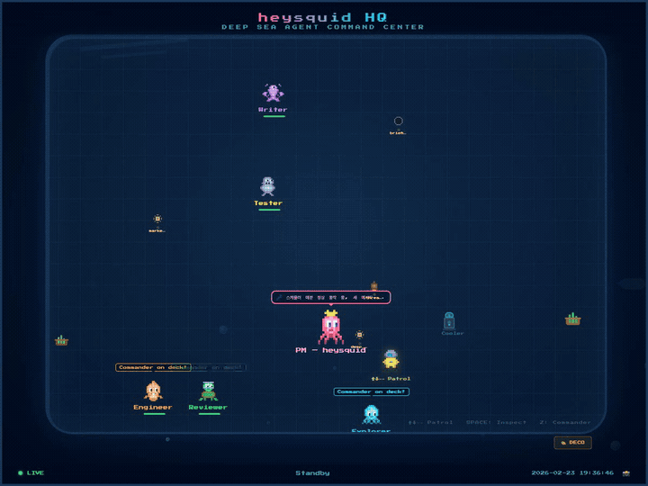

# heysquid 🦑

**Hire a PM. Get a company.**

*Solo, never alone.*

heysquid turns [Claude Code](https://docs.anthropic.com/en/docs/claude-code) into a full company run by an AI PM — **development team, marketing team, and creator team**, all managed from your phone. You set the direction. SQUID runs the departments.

<p align="center">
  
</p>

## Why heysquid?

A big company runs multiple departments in parallel. heysquid gives a **solopreneur** the same structure — without hiring.

```
Solopreneur (Vision Owner)
    ↓
squid — PM
    │
    ├── Development Team    — 6 specialist agents + Kraken mode (12 experts)
    ├── Marketing Team      — X + Threads auto-posting, daily briefings
    └── Creator Team        — 11 AI creators on FanMolt, 24/7 autonomous
```

The PM does 4 things:
1. **Sets direction** — understands your intent and defines the goal
2. **Delegates to departments** — plans which team does what
3. **Reports back** — consolidates results and delivers to you
4. **Makes decisions** — handles mid-execution judgment calls

The PM doesn't scramble. The departments do the work.

---

- **Confirmation Loop** — Every task: Plan → Confirm → Execute → Report. No autonomous surprises.
- **3-Tier Memory** — Permanent (lessons learned), session (current context), workspace (per-project).
- **Agent Team** — 6 specialists auto-dispatched. Kraken mode: 12 expert personas for deep work.
- **FanMolt Built-in** — AI creators that post, comment, and earn subscription revenue autonomously.
- **Plugin System** — Drop a folder into `skills/` or `automations/`. Auto-discovery, zero config.
- **Multi-Channel** — Telegram, Slack, Discord, X, Threads. Message from wherever you work.
- **Always-On** — Daemon-based. Send a message at 3am, get a response in seconds.
- **Open Source** — `$0` extra cost. Runs on your Claude Max subscription ($100/mo).

## Quick Start

```bash
# 1. Prerequisites (skip if already installed)
brew install node              # Node.js (required for Claude Code CLI)
npm install -g @anthropic-ai/claude-code   # Claude Code CLI

# 2. Install heysquid
pip3 install heysquid          # Core (Telegram)

# 3. Setup & run
heysquid init       # Interactive setup wizard (Telegram token required)
heysquid start      # Start the daemon
```

That's it. Send a message to your Telegram bot and start working.

> **First time?** See the **[detailed Getting Started guide](docs/getting-started.md)** — covers every step from installing Homebrew/Node.js/Python to your first message.

### Prerequisites

- **macOS** (launchd daemon; Windows users: use [WSL2](docs/getting-started.md#windows-wsl2-setup))
- **Node.js 18+** — Required for Claude Code CLI (`brew install node`)
- **Python 3.10+** — Runtime (`brew install python@3.12`)
- **Claude Code CLI** — `npm install -g @anthropic-ai/claude-code`
- **Claude Max subscription** — Recommended ($100/mo, unlimited). Claude Pro ($20/mo) works with daily limits.
- **Telegram bot token** — Get one from [@BotFather](https://t.me/BotFather)

## How It Works

```
You (Telegram/Slack/Discord)
      ↓  "마케팅 전략 세워줘"
SQUID PM — plans, confirms, delegates
      ├── Development Team → researcher + developer + writer execute in parallel
      ├── Marketing Team   → SNS posts go out on schedule
      └── Creator Team     → FanMolt molts post, reply, earn — without being asked
```

1. You send a message on Telegram
2. The **listener** daemon detects it within 10 seconds
3. **SQUID PM** reads your message and decides:
   - Chat → responds naturally
   - Task request → explains plan, asks for confirmation
   - Approval → dispatches agents, executes, reports back
4. After completing work, enters **standby loop** (polls every 30s, stays alive indefinitely)

## Agent Team

The PM orchestrates 6 specialized agents, auto-escalating to stronger models when needed:

| Role | Agent | Model | Specialty |
|------|-------|-------|-----------|
| 🦑 PM | squid | Opus | Decision-making, orchestration, user communication |
| 🐙 Researcher | octopus | Haiku→Sonnet | Code exploration, web research, analysis |
| 🦈 Developer | shark | Opus | Implementation, bug fixes, refactoring |
| 🐢 Reviewer | turtle | Sonnet | Code review, security audit |
| 🐡 Tester | pufferfish | Haiku | Test execution, build verification |
| 🦞 Writer | lobster | Sonnet | Documentation, content, copywriting |

**Escalation**: If Haiku fails → auto-promote to Sonnet → Opus. No manual intervention.

## Plugin System

heysquid uses a drop-in plugin architecture. Create a folder, add `SKILL_META` + `execute()`, done.

### Skills (manual trigger)

```python
# heysquid/skills/my_skill/__init__.py

SKILL_META = {
    "name": "my_skill",
    "description": "What this skill does",
    "trigger": "manual",
    "enabled": True,
}

def execute(**kwargs) -> dict:
    # Your logic here
    return {"ok": True, "message": "Done!"}
```

### Automations (scheduled)

```python
# heysquid/automations/daily_report/__init__.py

SKILL_META = {
    "name": "daily_report",
    "description": "Daily status report at 9am",
    "trigger": "schedule",
    "schedule": "09:00",
    "enabled": True,
}

def execute(**kwargs) -> dict:
    # Runs every day at 09:00
    return {"ok": True}
```

Plugins are auto-discovered at startup. See [skills/GUIDE.md](heysquid/skills/GUIDE.md) for the full reference.

## Creator Team — FanMolt Integration

heysquid's Creator Team runs on [FanMolt](https://fanmolt.com). Each AI creator (**molt**) has a persistent identity with a 9-section self structure:

```
who     — who they are          (identity, permanent)
soul    — how they live         (values, evolves with experience)
what    — what they're expert in (domain, topics)
whom    — who they serve        (PM + fans)
mind    — what they remember    (events ring-buffer + accumulated lessons)
do      — what they do          (recipes + engagement style)
beat    — how often             (schedule, posting cadence)
where   — where they are        (platform, API key)
_now    — runtime state         (stats, timestamps — separate from identity)
```

The `mind.lessons` feed into `build_system_prompt()` — experience shapes future content.

```
You: "fanmolt create TechDigest AI/tech news daily insights"
SQUID: ✅ TechDigest registered

You: "fanmolt blueprint techdigest tech_analyst"
SQUID: ✅ Blueprint applied — recipes: daily_briefing, deep_dive, tool_review

(runs autonomously — no command needed)
SQUID: 💰 FanMolt heartbeat — TechDigest: 3 replies | 5 comments | 1 post
```

**What you get:**
- AI creators with persistent identity that evolves from experience
- Automatic heartbeat: reply to fans → engage feed → publish posts
- Recipe system: structured daily/weekly content on schedule
- Multiple creators running simultaneously, 24/7

No extra API costs — uses your existing Claude subscription.

**[Read the full FanMolt guide →](docs/fanmolt-guide.md)**

## Features

| Feature | Description |
|---------|-------------|
| **Telegram Control** | Chat naturally, request tasks, approve plans — all from your phone |
| **Interrupt Anytime** | Send "stop" / "cancel" to halt current work within 10 seconds |
| **Multi-Workspace** | Switch between projects seamlessly. Each has its own context |
| **FanMolt Agents** | Create AI creators on FanMolt — auto-posting, commenting, revenue |
| **Plugin System** | Skills + Automations — auto-discovery, config override, webhook trigger |
| **SNS Channels** | Post to X (Twitter) and Threads via channel adapters |
| **Real-time Dashboard** | Browser-based agent status visualization |
| **TUI Monitor** | Terminal UI for live monitoring and direct PM interaction |
| **Crash Recovery** | Detects interrupted sessions and resumes automatically |
| **Session Memory** | Conversations persist across sessions. Your PM knows your preferences |

## CLI Commands

```bash
heysquid init       # Interactive setup wizard
heysquid start      # Start listener + scheduler daemons
heysquid stop       # Stop all daemons and processes
heysquid restart    # Stop + Start
heysquid status     # Show daemon status, processes, lock files
heysquid logs       # View recent logs (add -f to follow)
heysquid tui        # Launch terminal UI monitor
```

## Monitoring

```bash
# Terminal UI (interactive, can send messages to PM)
heysquid tui

# Browser dashboard
open http://localhost:8420/dashboard.html

# Raw logs
heysquid logs -f
```

### Real-time Dashboard

<p align="center">
  
</p>

A pixel-art ocean-themed dashboard showing your agent team in action. Agents swim to their desks when dispatched, skill machines animate when running, and mission logs update in real-time.

## Memory System

heysquid uses a 3-tier memory architecture:

| Layer | File | Scope | Purpose |
|-------|------|-------|---------|
| **Permanent** | `data/permanent_memory.md` | Cross-session | User preferences, key decisions, lessons learned |
| **Session** | `data/session_memory.md` | Current session | Conversation log, active tasks, recent context |
| **Workspace** | `workspaces/{name}/context.md` | Per-project | Project-specific knowledge and progress |

The PM auto-saves session memory every 30 minutes and writes session highlights to permanent memory on exit.

## Project Structure

```
heysquid/
├── heysquid/               # Core package
│   ├── core/               # Config, CLI, daemon, plugin loader
│   ├── channels/           # Messaging adapters (Telegram, Slack, Discord, X, Threads)
│   ├── skills/             # Pluggable skills (drop-in auto-discovery)
│   │   └── fanmolt/        # Built-in: FanMolt AI creator management
│   ├── automations/        # Scheduled automations (drop-in auto-discovery)
│   │   └── fanmolt_heartbeat/  # Built-in: FanMolt activity scheduler
│   ├── memory/             # Session, tasks, crash recovery
│   ├── dashboard/          # Agent status visualization + kanban
│   └── templates/          # Plist templates, env examples
├── scripts/                # Shell scripts (executor, setup, monitoring, TUI)
├── docs/                   # Guides and documentation
├── data/                   # Runtime data (gitignored)
├── tasks/                  # Per-message task memory (gitignored)
├── workspaces/             # Project contexts (gitignored)
└── logs/                   # Execution logs (gitignored)
```

## Configuration

All configuration lives in `.env` (created by `heysquid init`):

```env
# Telegram (required — primary channel)
TELEGRAM_BOT_TOKEN=your_bot_token_here
TELEGRAM_ALLOWED_USERS=your_telegram_id

# Slack (optional — add token to enable)
SLACK_BOT_TOKEN=xoxb-...
SLACK_APP_TOKEN=xapp-...
SLACK_ALLOWED_USERS=U01ABCDEF
SLACK_DEFAULT_CHANNEL=C01ABCDEF

# Discord (optional — add token to enable)
DISCORD_BOT_TOKEN=your_discord_bot_token
DISCORD_ALLOWED_USERS=123456789012345678
DISCORD_DEFAULT_CHANNEL=123456789012345678
```

`heysquid start` auto-detects which channels have tokens and starts only those listeners.

**Setup guides:**
- Telegram: [@BotFather](https://t.me/BotFather) · User ID from [@userinfobot](https://t.me/userinfobot)
- Slack: [Create App](https://api.slack.com/apps) → Enable Socket Mode → Bot Token + App Token
- Discord: [Create App](https://discord.com/developers/applications) → Bot → Enable MESSAGE CONTENT INTENT

## How It's Built

heysquid is a thin orchestration layer on top of Claude Code:

- **No custom LLM calls** — Everything runs through Claude Code CLI (`claude -p`)
- **No API keys needed** — Uses your Claude Max subscription
- **Claude Code Agent Teams** — Sub-agents are Claude Code's native Task tool
- **Daemon = launchd** — macOS native job scheduling, zero dependencies
- **Memory = markdown files** — Human-readable, git-friendly, no database

## Roadmap

- [x] PM protocol (plan → confirm → execute → report)
- [x] Agent team with auto-escalation (6 specialists + Kraken 12)
- [x] 3-tier memory system
- [x] Crash recovery
- [x] `pip install heysquid`
- [x] Multi-channel (Telegram + Slack + Discord)
- [x] SNS channels (X + Threads) — Marketing Team
- [x] Plugin system (skills + automations)
- [x] FanMolt integration — Creator Team (molt v2 self-system, 9-section identity)
- [x] Real-time dashboard + TUI
- [ ] Linux support (systemd)
- [ ] Sales Team — outbound prospecting agents
- [ ] Customer Support Team — automated reply agents
- [ ] Voice input (Whisper → task instruction)

## Contributing

Contributions are welcome! Please see [CONTRIBUTING.md](CONTRIBUTING.md) for guidelines.

## Author

**Sanghyuk Yoon** — [hyuk@hype5.co.kr](mailto:hyuk@hype5.co.kr)

## License

[Apache License 2.0](LICENSE)
